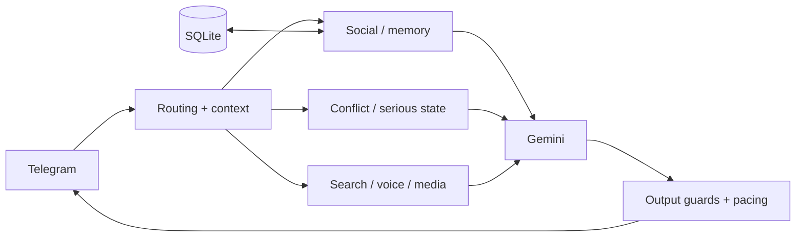

# Яйцеслав / Yayceslav

[](https://github.com/oblakaF/yayceslav-bot/actions/workflows/v2-ci.yml)


**Context-aware Telegram AI groupmate with social memory, voice, web search, stickers and fight-aware conversation routing.**

Яйцеслав — Telegram-бот, который задуман не как меню slash-команд, а как постоянный участник группового чата со своим характером, памятью о взаимодействиях и разным поведением в зависимости от ситуации.

> **Public source-available edition.** Production tokens, private user data, live databases, hosting credentials and unreleased private work are not published here.

## What makes Yayceslav different

Yayceslav combines ordinary assistant capabilities with a deliberately social conversation layer:

- **group-aware conversation** — different behavior in private chats and groups;
- **social memory** — bounded member context, reputation and relationship history;
- **serious-topic priority** — sensitive situations suppress comedy and aggression;
- **voice and media** — voice replies and context from supported media/document flows;
- **web search** — bounded search enrichment when fresh information is needed;
- **stickers** — semantic sticker behavior with anti-spam pacing;
- **fight-aware routing** — temporary conflict state is separated from long-term relationships;
- **grounded roast planning** — repetition, contradictions and visible self-owns can be preferred over generic insults;
- **resource-conscious design** — SQLite, bounded RAM state and a single-process deployment rather than a fleet of background services.

The project intentionally treats **silence, restraint and context** as important behavior. A stronger persona should not make factual answers worse or turn serious conversations into jokes.

## Architecture



Stateful concerns have explicit owners; supporting runtimes enrich those owners instead of creating parallel state machines. See **[docs/architecture.md](docs/architecture.md)** for the current public architecture map.

## Quick start

### Requirements

- Python 3.12 or 3.13
- Telegram bot token
- Gemini API key

### Install

```bash
git clone https://github.com/oblakaF/yayceslav-bot.git
cd yayceslav-bot

python -m venv .venv
source .venv/bin/activate        # Linux/macOS
# .venv\Scripts\activate       # Windows

python -m pip install -r requirements.txt
```

Create a local `.env` file:

```env
TELEGRAM_BOT_TOKEN=your_token
GEMINI_API_KEY=your_key
BOT_OWNER_ID=optional_numeric_telegram_id
```

Then run:

```bash
python bot.py
```

Do not commit real tokens or production data.

## Persistence

Yayceslav uses SQLite for persistent state. Locally the database lives under `data/`; on a Railway-style deployment the app can use a persistent `/app/data` mount.

Schema changes are applied through startup migration helpers designed to preserve existing data. Production databases are excluded from Git.

## Tests

```bash
python -m pip install -r requirements-dev.txt
pytest -q
```

GitHub Actions runs the full CI suite for pull requests to `main` and for pushes to `main` on Python **3.12** and **3.13**.

## Telegram privacy

Group context is limited by the updates Telegram actually sends to the bot. With Telegram Privacy Mode enabled, ordinary group messages may not be visible, which makes background statistics and social context incomplete.

Operators are responsible for configuring Telegram permissions appropriately and for complying with applicable privacy/data-protection requirements.

## Public repository vs. production

This repository is a **curated public codebase**, not a promise that every production detail will always be published.

The live bot may use:

- private environment configuration;
- a private SQLite database containing real social state;
- private operational notes and diagnostics;
- newer unreleased experiments or future private-version work.

No real production token, private chat export or production database should ever be committed here.

## Documentation

- **[Architecture](docs/architecture.md)** — runtime ownership and design boundaries
- **[Deployment](docs/deployment.md)** — local/hosting setup and persistence
- **[Public roadmap](docs/roadmap.md)** — current public direction
- **[Changelog](CHANGELOG.md)** — notable public changes
- **[Security](SECURITY.md)** — vulnerability and secrets policy
- **[Contributing](CONTRIBUTING.md)** — contribution policy
- **[Copyright](COPYRIGHT.md)** — ownership notice
- **[Branding](TRADEMARKS.md)** — project identity notice

## Ownership and license

**Yayceslav (Яйцеслав) is an original software project created and developed by Vadim Krysko.**

Copyright © 2026 **Vadim Krysko**. All rights reserved.

The repository is public for source inspection but is **not open source**. It is distributed under the **Yayceslav Source-Available Proprietary License v1.0**. Viewing and limited personal evaluation are permitted as described in [`LICENSE`](LICENSE); redistribution, public derivative hosting and commercial use require permission unless applicable law gives an independent right.

See [`COPYRIGHT.md`](COPYRIGHT.md) and [`TRADEMARKS.md`](TRADEMARKS.md) for additional ownership and project-identity notices.
