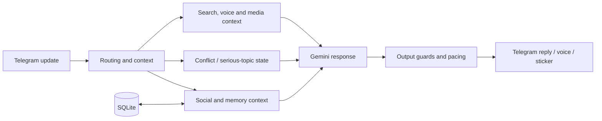

# Architecture

Yayceslav is a modular Telegram bot built around a single application process, SQLite persistence, bounded in-memory state, and one primary Gemini generation path.

The project deliberately avoids turning every behavior into a separate agent or state machine. Stateful concerns have explicit owners and supporting layers enrich those owners rather than duplicating them.

## High-level flow



## Production ownership

| Concern | Primary owner | Supporting layers |
| --- | --- | --- |
| Telegram entry point and persistence integration | `bot.py` | `runtime_bootstrap.py`, schema migrations |
| Application startup order | `runtime_bootstrap.py` | explicit runtime preparation functions |
| Persistent social baseline | `social_priority_runtime.py` | reputation, member profile and relationship runtimes |
| Temporary conflict phase | `conflict_fsm_runtime.py` | `title_conflict_runtime.py`, social context |
| Fight routing | `fight_routing_v3.py` | `fight_patterns.py`, fight memory and pacing helpers |
| RAGE punch planning | `roast_engine.py` | `roast_engine_runtime.py`, `roast_lexicon.py` |
| Claim-sensitive memory | `claim_memory_v3.py` | bounded short-term and monthly memory layers |
| Search | `search_enrichment_runtime.py` | search context, slang, lexical and evidence-grounding layers |
| Voice and recent media | `voice2_runtime.py` | `recent_video_note_runtime.py` |
| Stickers | `sticker_runtime.py` / `sticker_engine.py` | semantic tuning, post-text behavior and fight budget |

## Design rules

1. One production owner per stateful concern.
2. A helper may enrich input or output, but must not create a competing state machine.
3. New behavior should reuse the existing Gemini request whenever practical rather than adding another model call.
4. Serious and sensitive topics override comedy, aggression and social games.
5. Long-lived data belongs in SQLite; transient fight/turn state is bounded and expires.
6. Production startup order is explicit in `runtime_bootstrap.py`.
7. Historical rollback modules may remain in Git history, but they are not production merely because an old file or branch exists.

## Memory model

The bot intentionally uses bounded storage rather than an unlimited raw chat archive.

- short conversational context is temporary;
- social/reputation state is stored in SQLite;
- selected episodic/member memories are bounded;
- sensitive claims are guarded from silently becoming biographical facts;
- production databases and user data are not committed to this repository.

## Fight subsystem

The fight path is layered rather than implemented as one giant prompt:

```text
social baseline
    -> conflict FSM
    -> fight routing
    -> grounded fight memory / pacing
    -> roast planner
    -> existing Gemini response
```

The planner can prefer observed repetition, contradictions and sequence-level self-owns while keeping exact recent target-authored evidence available to the final response. Delayed follow-ups and fight stickers have bounded budgets and are cancelled or suppressed when the conversation reconciles or turns serious.

## Tests

Architecture boundaries are covered by regression tests, including tests that ensure legacy conflict runtimes are not accidentally reinstalled and that the current ownership chain remains ordered correctly.

For implementation details, inspect `runtime_bootstrap.py` and the corresponding tests in `tests/`.
